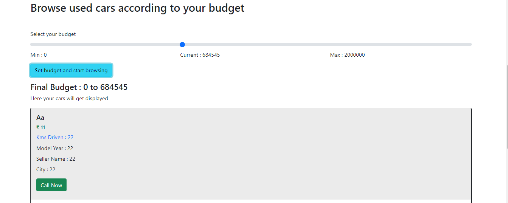

> 2/11/2021 - 10:45 PM

# index page

## intro section

## features section

## form to predict price

## Prediction result

# car listing page without login

# browse car page

## first section

## select budget

## listed cars according to budget

## listed car section card

## index page after user gets logged in

# list cars form after logging in 

# User Dashboard

